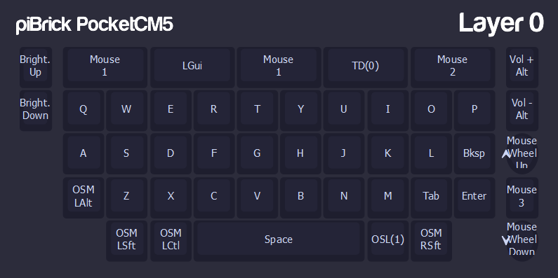
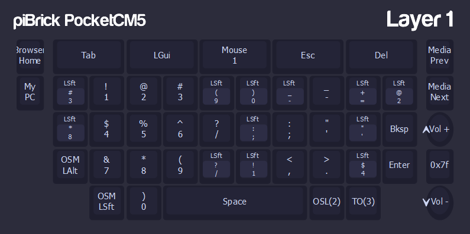
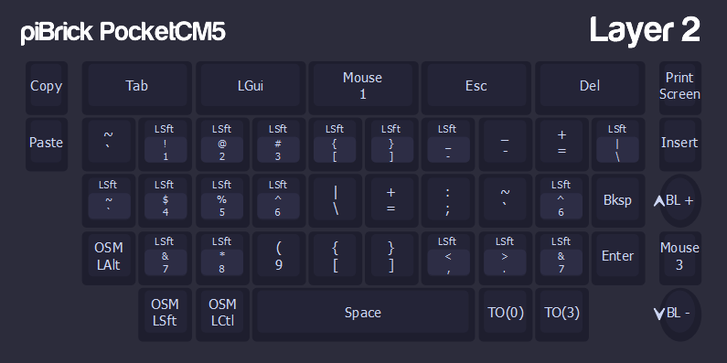
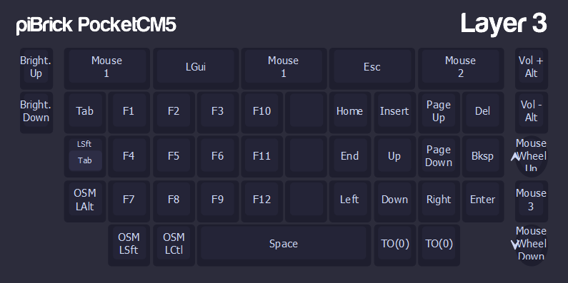

# piBrick PocketCM5 Keyboard Firmware
[piBrick PocketCM5](https://github.com/amarullz/piBrick/blob/main/Pocket-CM5/) Keyboard Firmware

## Make VIAL
```
make pibrick_pocketcm5_keyboard:default
```

## How to Flash Keyboard Firmware
- Turn Off Device
- Push and Hold User Button 1 (Middle Left below USB2 Connetor)
- Plug Bottom USB-C to your PC
- It will shown on your PC as Mass Storage with label `RPI-RP2`
- Copy `uf2` firmware into `RPI-RP2`
- Keyboard will auto restart and shown as HID in your PC
- You can turn on your device

## Customize your Keys
You can customize your keys with [https://vial.rocks/](https://vial.rocks/)

---
## Default Keymaps
### Layer 0

Layer-0 is default layer, mainly as Alpha Character.
- LGui / Super Key on Top Panel
- Mouse drag using Green/Call Button, Right Click with Red/Hangup Button
- Back button is configured as TAP-DANCE with this configuration
  - Default TAP: ESC
  - Tap and Hold: Toggle trackpad mode
    - **Blinking:** Arrow Mode
    - **Static/Default:** Mouse Mode
- `TAB` is on Dollar `$` Key close to `Enter`
- Modifier Keys (ALT, CTRL, SHIFT) is on `OSM` mode. It means you can tap it once then press other key to do the combination, but you can also tap and hold the mods simultanously with other keys.
- Press `SYM` to move to `Layer-1`, It's also single mode. It will only process single character and will going back into Layer-0 imediately, or you can tap and hold `SYM` to stay in `Layer-1`

### Layer 1

Layer-1 is main characters & numeric layer which printed on pyshical keyboard
- Press `SYM` again to go into `Layer-2`
- Press `Right Shift` to go into `Layer-3`

### Layer 2

Layer-2 is for extended characters
- Press `SYM` again to go back into `Layer-0`
- Press `Right Shift` to go into `Layer-3`

### Layer 3

Layer-3 is Function and Navigation layers

### Layers Tips
- You can go to `Layer-2` from Default layer by simply `Double-Tap` the `SYM` Key.
- You can go to `Layer-3` from Default layer by simply tap `SYM` then `Right Shift` Keys.
- Tap and Hold `BACK` button to toggle Trackpad mode and use it as Arrow Keys. Trackpad click will becoming `ENTER` when you are on Arrow Mode.
- Double Tap and Hold the `SYM` key then rotate the Rotary Wheel to change keyboard backlight
- Double Tap `SYM` then tap `$` for Ampersand `&`

---

## Hardware Pinout
**Column GPIO**
- `GPIO 8`
- `GPIO 9`
- `GPIO 10`
- `GPIO 11`
- `GPIO 12`
- `GPIO 13`

**Rows GPIO**
- `GPIO 1`
- `GPIO 2`
- `GPIO 3`
- `GPIO 4`
- `GPIO 5`
- `GPIO 6`
- `GPIO 7`

**Direct & Rotary Pins GPIO**
- `GPIO 24` - User Button 1 (Left Top)
- `GPIO 17` - User Button 2 (Left Bottom)
- `GPIO 0`  - User Button 3 (Right Top)
- `GPIO 15` - User Button 4 (Right Bottom)
- `GPIO 20` - User Button 5 (Rotary Switch)
- `GPIO 14` - BBQ20 End/Hangup Button
- `GPIO 19` - Rotary Encoder A
- `GPIO 21` - Rotary Encoder B

**Backlight & Indicators**
- `GPIO 25` - Keyboard backlight
- `GPIO 29` - Panel Backlight (Arrow mode indicator)
- `GPIO 26` - Red Indicator
- `GPIO 27` - Green Indicator
- `GPIO 28` - Blue Indicator

**Trackpad**
- `GPIO 16` - Trackpad Reset
- `GPIO 22` - Trackpad Motion
- `GPIO 23` - Trackpad I2C SCL
- `GPIO 18` - Trackpad I2C SDA
