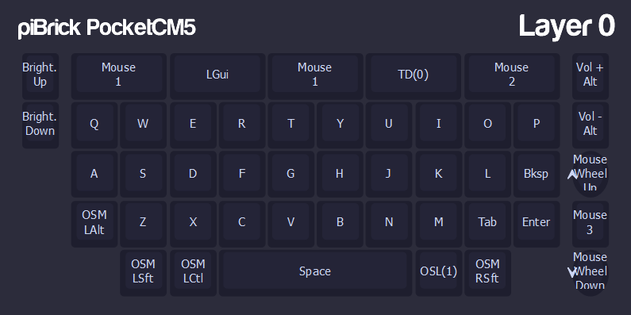
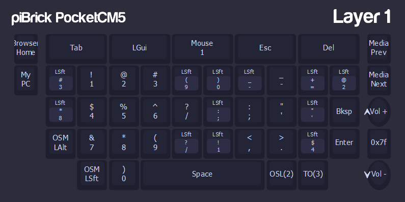
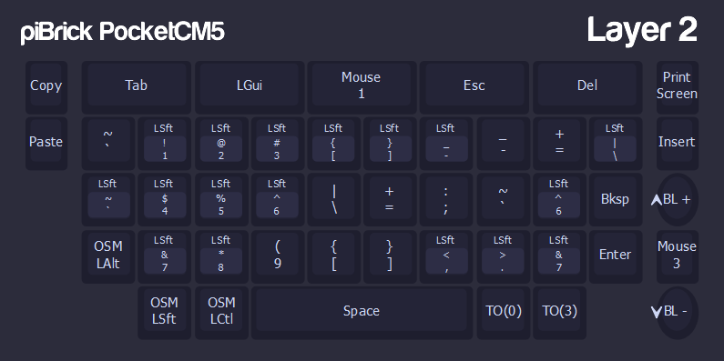
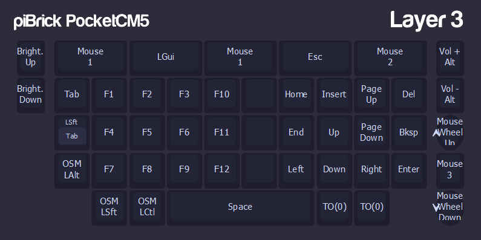

# piBrick PocketCM5 Keyboard Firmware
[piBrick PocketCM5](https://github.com/amarullz/piBrick/blob/main/Pocket-CM5/) Keyboard Firmware

## Make VIAL
```
make pibrick_pocketcm5_keyboard:default
```

## How to Flash the Keyboard Firmware
- Turn off the device
- Move HID/Keyboard Switch to Bottom
- Press and hold **User Button 1** (middle-left, below the USB2 connector)
- Plug the bottom USB-C port into your PC
- The device will appear on your PC as a mass storage device labeled `RPI-RP2`
- Copy the `uf2` firmware file into `RPI-RP2`
- The keyboard will automatically restart and appear as an HID device on your PC
- You can now turn on your device

## Customize your Keys
You can customize your keys using [https://vial.rocks/](https://vial.rocks/)
- If you mess up the `VIAL` configuration and want to reset the keymaps, you can download [pibrick_pocketcm5-default-keymaps.vil](docs/pibrick_pocketcm5-default-keymaps.vil)

---
## Default Keymaps
### Layer 0

Layer 0 is the default layer, mainly for letter characters.
- **LGui / Super Key** is on the top panel
- Mouse drag using the **Green / Call** button, right-click using the **Red / Hangup** button
- The **Back** button is configured as a TAP-DANCE key with the following behavior:
  - Default tap: `ESC`
  - Tap and hold: Toggle trackpad mode  
    - **Blinking:** Arrow mode  
    - **Static / Default:** Mouse mode
- `TAB` is on the dollar `$` key, close to `Enter`
- Modifier keys (`ALT`, `CTRL`, `SHIFT`) use `OSM` mode. You can tap a modifier once and then press another key to apply the combination, or tap and hold the modifier simultaneously with other keys.
- Press `SYM` to move to **Layer 1**. This is a single-shot mode: it processes one character and immediately returns to Layer 0. You can also tap and hold `SYM` to stay in Layer 1.

### Layer 1

Layer 1 contains the main symbols and numeric characters printed on the physical keyboard.
- Press `SYM` again to go to **Layer 2**
- Press `Right Shift` to go to **Layer 3**

### Layer 2

Layer 2 is used for extended characters.
- Press `SYM` again to return to **Layer 0**
- Press `Right Shift` to go to **Layer 3**

### Layer 3

Layer 3 contains function and navigation keys.

### Layers Tips
- You can go to **Layer 2** from the default layer by double-tapping the `SYM` key.
- You can go to **Layer 3** from the default layer by tapping `SYM` and then `Right Shift`.
- Tap and hold the `BACK` button to toggle trackpad mode and use it as arrow keys. The trackpad click becomes `ENTER` when in Arrow mode.
- Double-tap and hold the `SYM` key, then rotate the rotary wheel to change the keyboard backlight.
- Double-tap `SYM`, then tap `$` to input an ampersand `&`.

---

## Hardware Pinout
**Column GPIO**
- `GPIO 8`
- `GPIO 9`
- `GPIO 10`
- `GPIO 11`
- `GPIO 12`
- `GPIO 13`

**Rows GPIO**
- `GPIO 1`
- `GPIO 2`
- `GPIO 3`
- `GPIO 4`
- `GPIO 5`
- `GPIO 6`
- `GPIO 7`

**Direct & Rotary Pins GPIO**
- `GPIO 24` - User Button 1 (Left Top)
- `GPIO 17` - User Button 2 (Left Bottom)
- `GPIO 0`  - User Button 3 (Right Top)
- `GPIO 15` - User Button 4 (Right Bottom)
- `GPIO 20` - User Button 5 (Rotary Switch)
- `GPIO 14` - BBQ20 End/Hangup Button
- `GPIO 19` - Rotary Encoder A
- `GPIO 21` - Rotary Encoder B

**Backlight & Indicators**
- `GPIO 25` - Keyboard backlight
- `GPIO 29` - Panel Backlight (Arrow mode indicator)
- `GPIO 26` - Red Indicator
- `GPIO 27` - Green Indicator
- `GPIO 28` - Blue Indicator

**Trackpad**
- `GPIO 16` - Trackpad Reset
- `GPIO 22` - Trackpad Motion
- `GPIO 23` - Trackpad I2C SCL
- `GPIO 18` - Trackpad I2C SDA

---

# piBrick Keyboard Control `pibrick-kbd.sh`

`pibrick-kbd.sh` is a command-line utility for controlling the piBrick PocketCM5 Keyboard through its Raw HID interface.

**It supports:**
- Backlight timeout
- Backlight brightness
- RGB LED control
- Temporary RGB colors
- Reading current settings
- Automatic Raw HID device detection

## Requirements

- Linux
- Bash
- `udevadm`
- `dd`
- `od`
- piBrick PocketCM5 firmware with Raw HID support

**Make the script executable:**
```bash
chmod +x pibrick-kbd.sh
```

If access to `/dev/hidraw*` requires root permission, run it with `sudo`.

## Usage

```text
./pibrick-kbd.sh [-q] <command> [argument]
```

The `-q` option enables quiet mode and outputs only the requested value.

### Commands

| Command | Description |
|---|---|
| `timeout` | Get backlight timeout |
| `timeout <seconds>` | Set backlight timeout |
| `backlight` | Get backlight level |
| `backlight <0-8>` | Set backlight level |
| `rgb <RRGGBB>` | Set RGB color |
| `rgb <RRGGBB> <milliseconds>` | Set RGB color temporarily |
| `rgb 0` | Turn RGB off |
| `-q` | Quiet mode |

## Backlight Timeout

The timeout determines how long the keyboard backlight remains on after the last user interaction.

The timeout is stored in the keyboard EEPROM and survives reboot or USB reconnect.

### Get timeout

```bash
sudo ./pibrick-kbd.sh timeout
```

Example:

```text
Using /dev/hidraw2
Backlight timeout: 12 seconds
```

With quiet mode:

```bash
sudo ./pibrick-kbd.sh -q timeout
```

Output:

```text
5
```

### Set timeout

```bash
sudo ./pibrick-kbd.sh timeout <seconds>
```

Example:

```bash
sudo ./pibrick-kbd.sh timeout 10
```

Output:

```text
Using /dev/hidraw2
Timeout set to 10 seconds.
```

Valid range:

```text
0-255 seconds
```

A timeout value of `0` is replaced by the firmware with the default timeout.

## Backlight

The backlight has 9 brightness levels:

| Level | Brightness |
|---:|---:|
| `0` | Off |
| `1` | 1% |
| `2` | 3% |
| `3` | 6% |
| `4` | 12% |
| `5` | 25% |
| `6` | 45% |
| `7` | 70% |
| `8` | 100% |

### Get backlight level

```bash
sudo ./pibrick-kbd.sh backlight
```

With quiet mode:

```bash
sudo ./pibrick-kbd.sh -q backlight
```

Example output:

```text
5
```

### Set backlight level

```bash
sudo ./pibrick-kbd.sh backlight <0-8>
```

Maximum brightness:

```bash
sudo ./pibrick-kbd.sh backlight 8
```

Approximately 25% brightness:

```bash
sudo ./pibrick-kbd.sh backlight 5
```

Turn the backlight off:

```bash
sudo ./pibrick-kbd.sh backlight 0
```

## RGB LED

RGB colors use a 6-digit hexadecimal value:

```text
RRGGBB
```

Examples:

| Color | Value |
|---|---|
| Red | `FF0000` |
| Green | `00FF00` |
| Blue | `0000FF` |
| White | `FFFFFF` |
| Custom | `338866` |

### Set RGB color

```bash
sudo ./pibrick-kbd.sh rgb 338866
```

The LED remains at the selected color until another RGB command changes it.

### Turn RGB off

```bash
sudo ./pibrick-kbd.sh rgb 0
```

This is equivalent to:

```bash
sudo ./pibrick-kbd.sh rgb 000000
```

### Temporary RGB color

```bash
sudo ./pibrick-kbd.sh rgb <RRGGBB> <milliseconds>
```

For example, red for 500 ms:

```bash
sudo ./pibrick-kbd.sh rgb FF0000 500
```

Green for 1 second:

```bash
sudo ./pibrick-kbd.sh rgb 00FF00 1000
```

The valid duration range is:

```text
0-65535 milliseconds
```

## RGB Animation

The RGB command can be used directly from the shell to create simple animations.

For example, a continuous color cycle:

```bash
while true; do
    for color in FF0000 FF8000 FFFF00 00FF00 00FFFF 0000FF 8000FF FF00FF; do
        sudo ./pibrick-kbd.sh -q rgb "$color"
        sleep 0.05
    done
done
```

Press `Ctrl+C` to stop the animation.

Change the `sleep` value to control the speed:

```bash
sleep 0.1
```

makes it slower, while:

```bash
sleep 0.02
```

makes it faster.

## Quiet Mode

Use `-q` when the command is being used by another script.

Without quiet mode:

```bash
sudo ./pibrick-kbd.sh timeout
```

Output:

```text
Using /dev/hidraw2
5
```

With quiet mode:

```bash
sudo ./pibrick-kbd.sh -q timeout
```

Output:

```text
5
```

This makes it easy to use the result in shell variables.

Example:

```bash
timeout=$(sudo ./pibrick-kbd.sh -q timeout)
echo "Timeout: ${timeout}s"
```

Get the current backlight level:

```bash
level=$(sudo ./pibrick-kbd.sh -q backlight)
echo "Backlight level: $level"
```

## Raw HID Protocol

The keyboard uses a 32-byte Raw HID report.

The piBrick command ID is:

```text
0xFF
```

Command IDs:

| ID | Command |
|---:|---|
| `0x01` | Timeout |
| `0x02` | Backlight |
| `0x03` | RGB |

Operation IDs:

| ID | Operation |
|---:|---|
| `0x00` | GET |
| `0x01` | SET |

Status codes:

| Code | Meaning |
|---:|---|
| `0x00` | OK |
| `0x01` | ERROR |

The script checks the firmware response status before reporting a successful operation.

### Timeout

GET request:

```text
FF 01 00
```

Response:

```text
FF 01 00 SS
```

`SS` contains the timeout in seconds.

SET request:

```text
FF 01 01 SS
```

For example, 10 seconds:

```text
FF 01 01 0A
```

### Backlight

GET request:

```text
FF 02 00
```

Response:

```text
FF 02 00 LL
```

`LL` contains the current backlight level.

SET request:

```text
FF 02 01 LL
```

`LL` must be between `0` and `8`.

For maximum brightness:

```text
FF 02 01 08
```

### RGB

Set RGB:

```text
FF 03 RR GG BB 00 00
```

For `#338866`:

```text
FF 03 33 88 66 00 00
```

Set RGB with timeout:

```text
FF 03 RR GG BB LL HH
```

The duration is a 16-bit little-endian value:

```text
duration = LL + (HH << 8)
```

For 500 ms:

```text
500 = 0x01F4
```

The request is:

```text
FF 03 33 88 66 F4 01
```

Turn RGB off:

```text
FF 03 00 00 00 00 00
```

## HID Device Detection

The script automatically finds the piBrick Raw HID interface.

Device identifiers:

```text
VID: F10C
PID: 0001
Interface: 01
```

The Raw HID interface uses:

```text
Usage Page: 0xFF60
Usage:      0x0061
Interface: 1
```

For example, the interface may appear as:

```text
/dev/hidraw2
```

The `hidraw` number can change after reconnecting the keyboard or when other USB HID devices are connected.

For this reason, `pibrick-kbd.sh` detects the correct HID interface dynamically instead of relying on a fixed `/dev/hidrawX` path.

## Troubleshooting

### Device not found

Check the available HID devices:

```bash
ls -l /sys/bus/hid/devices/
```

You can also use:

```bash
hidapitester --list-detail
```

The piBrick Raw HID interface should show:

```text
F10C/0001: piBrick - PocketCM5 Keyboard
  usagePage: 0xFF60
  usage:     0x0061
  interface: 1
```

The corresponding device should normally be something like:

```text
/dev/hidraw2
```

### Permission denied

If the script cannot access `/dev/hidraw2`, run it with `sudo`:

```bash
sudo ./pibrick-kbd.sh timeout
```

A udev rule can also be added if you want to use the script without `sudo`.

## Quick Reference

```bash
# Get timeout
sudo ./pibrick-kbd.sh -q timeout

# Set timeout to 10 seconds
sudo ./pibrick-kbd.sh timeout 10

# Get backlight
sudo ./pibrick-kbd.sh -q backlight

# Set maximum backlight
sudo ./pibrick-kbd.sh backlight 8

# Turn backlight off
sudo ./pibrick-kbd.sh backlight 0

# Set RGB
sudo ./pibrick-kbd.sh rgb 338866

# Set RGB for 500 ms
sudo ./pibrick-kbd.sh rgb 338866 500

# Turn RGB off
sudo ./pibrick-kbd.sh rgb 0
```